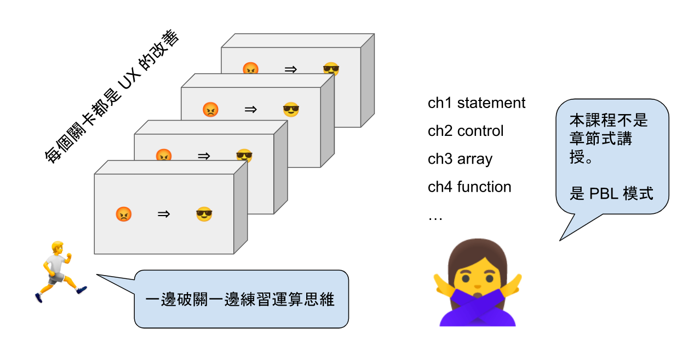
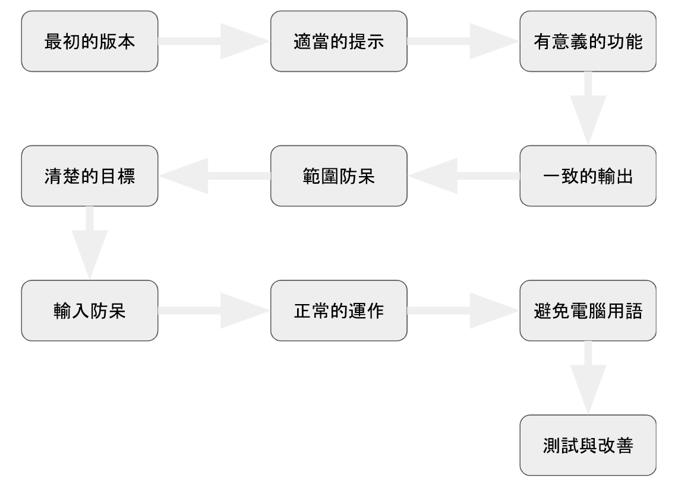
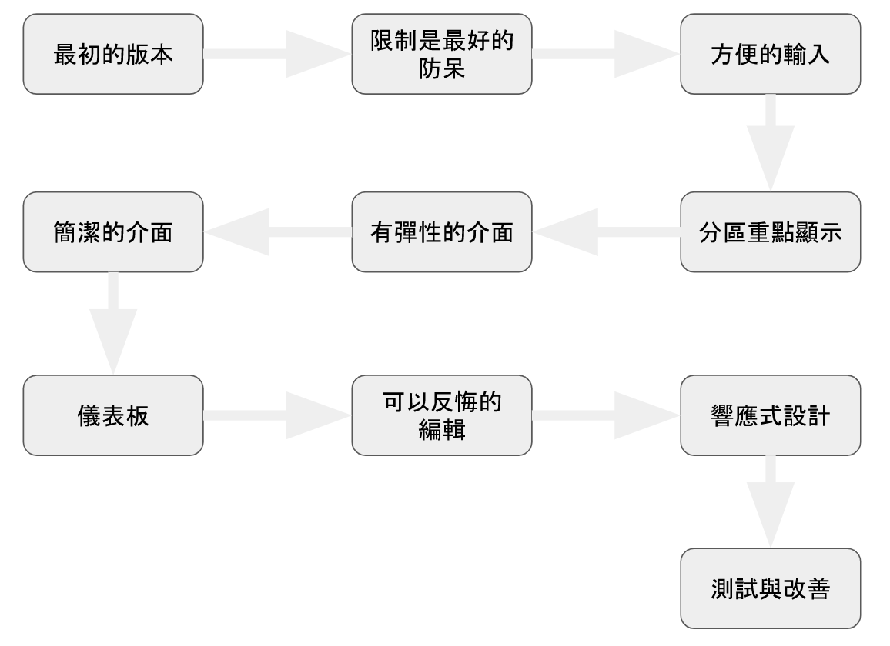

# 多元運算思維：使用者體驗設計

> 用運算思維和使用者體驗設計提供與改善資訊服務

完整線上課程請看 [這裡](https://www.openedu.tw/course?id=1557) 

## 教材使用說明（教師）
多半的教材在「使用體驗」和「運算思維」是分開的，本教材希望讓學生在實作中體驗使用體驗設計的概念。我們希望學習程式設計的學生在剛接觸程式設計的時候就能夠體驗 UX 的重要性。

## BMI-python

分為兩個模組，第一個是以 python 為主的基礎教材，程式碼請見 BMI-python 目錄，其程式碼之演進如下：

🍎 命令列 BMI 改版歷程
* BMIv0: 最初的版本

* BMIv1: 適當的提示
    * v0😡 無法執行，無窮迴圈
    * v0😩 沒有適當的提示單位，常造成使用者輸入錯誤 
    * 🍎 add() -> append()
    * 🍎 迴圈內加上輸入 
    * 🍎 給予必要資訊：加上提示單位以及結束時輸入 -999; 
    * 🍎 提升可讀性：BMI 取到小數點下一位

* BMIv2: 有意義的功能
    * v1😩 輸入 -999 的體重想終止，還要再輸入身高？是不是我輸入錯誤了？
    * v1😩 沒有名字或證號輸出的 BMI 也沒有意義
    * v1😩 -999 也太麻煩了，能不能簡單點？
    * 🍎 避免使用者困惑：透過 break 跳離迴圈
    * 🍎 提升系統解讀的意義：輸入時加入姓名，然後才是身高體重
    * 🍎 -9 to stop; 0 很容易造成和 O 的混淆

* BMIv3 一致的輸出
    * v2😩 如果第一次就輸入 -999, 程式沒有中斷，還要我繼續輸入 (user 很困惑)
    * v2😩 提示字重複的放在兩個地方，容易造成不一致 (程式模組化問題)
    * 🍎 邏輯的錯誤，透過 while True 來改善
    * 🍎 儘量抽象，不要有重複的程式碼

* BMIv4 範圍防呆
    * v3😩 即便我們寫得很清楚單位是公尺，使用者還是以公分輸入（台灣習慣）
    * 🍎 有錯誤的自由度(防呆)：設定合理的輸入範圍，若錯誤讓使用者重新輸入 
    * 體重 10-500kg
    * 身高 1.0-2.2m

* BMIv5 清楚的目標
    * v4😩 我們把使用者 BMI 都呈現出來做什麼？人好多看得我好亂
    * 🍎 確立目標：過重和過輕的人才是我們要提醒輔導的，而且是分開輔導

* BMIv6 輸入防呆
    * v5😩 一不小心把體重輸入為姓名，系統就跳出來了！！
    * 🍎 輸入防呆：透過 try … except 來要求使用者重新輸入

* BMIv7 正常的運作
    * v6😡 為什麼反覆的輸入體重？快瘋了
    * 🍎 解決邏輯錯誤

* BMIv8 避免電腦用語
    * v7😩 -9 to stop? Ctrl-C to stop? why, 那是什麼？
    * v7😩 身高輸入超過範圍時，全部必須重來？
    * 🍎 使用人性化的字眼控制流程
    * 🍎 改善防呆機制，降低使用者輸入的複雜度

* BMI9 測試與改善
    * v8😩 人多的時候，這樣的輸出是好的嗎？”測試” 看看才知道
    * v8😩 目前的程式可測試性太差，沒有模組化！！
    * 🍎 使用模組化，輸入、運算、輸出應該分開
    * 🍎 使用亂數產生一堆數據來進行測試
    * 🍎 人一多過輕和過重的人也多了，應該呈現出數量給管理者更多資訊

## BMI-web

第二個模組是以 web 來講解 UX 的重要，程式碼請見 BMI-web，其程式碼之演進如下：

🍎 Web BMI 改版歷程
* BMIw1: 最初的版本

* BMIw2: 限制是最好的防呆
    * w1😩 輸入沒有防呆
    * w1😩 不整齊的排版
    * 🍎 text ⇒ number; min, max
    * 🍎 置中; 使用 class, style

* BMIw3: 方便的輸入
    * w2😩 只想用滑鼠，很不想打字
    * 🍎 能選的，就不用打的：使用 select

* BMIw4: 分區重點顯示
    * w3😩 畫面凌亂，輸入和輸出沒有明顯的區隔
    * w3😩 畫面凌亂，姓名、身高、體重擠在一起
    * 🍎 fieldset, margin, max-width 設定

* BMIw5 有彈性的介面
    * w4😩 彙整的統計資料每次更新，使得畫面顯得零亂，無法驗證是否
    * 🍎 新增統計按鈕
    * 🍎 新增亂數產生資料以測試統計介面

* BMIw6 專注且簡潔的介面
    * w5 😩 輸入與觀看統計是兩件事，卻混雜在同一個介面
    * 🍎 輸入畫面與統計畫面不同時呈現
    * 🍎 一個 button 控制畫面的切換

* BMIw7 圖形化儀表板
    * w6 😩 文字化的呈現過重、過輕和標準的數量和比例，不容易觀察差異
    * 🍎 使用 D3 圓餅圖呈現

* BMIw8 可以修正資料
    * w7 😩 資料登入錯誤，無法修正！使用者一後輸入資料心驚驚。
    * 🍎 點及個人資料後會進入編修模式，進行編修。 

## 📂 Code in Github
[Code in GitHub](https://github.com/nlhsueh/ux-design/tree/main/BMI-web)